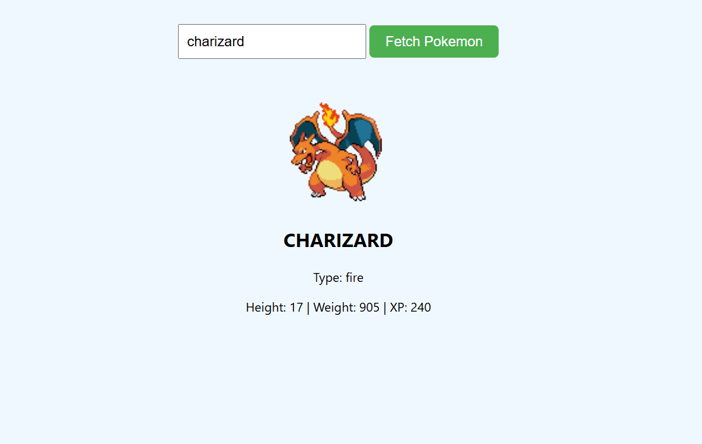

# 🕹️ Pokémon Fetch App

A fun, interactive JavaScript app that fetches live Pokémon data from the [PokéAPI](https://pokeapi.co/)!  
Type any Pokémon name and instantly see its image, type, height, weight, and experience.

---

## ✨ Features

- 🔍 Fetch Pokémon by name using `fetch()` and `async/await`
- 🧠 Displays:
  - Sprite Image
  - Name (capitalized)
  - Type
  - Height, Weight, XP
- ⚠️ Error handling if Pokémon is not found
- 📱 Responsive layout with clean design

---

## 📷 Preview



---

## 💡 Technologies Used

- HTML5
- CSS3
- JavaScript (ES6)
- Fetch API + async/await
- DOM manipulation

---

## 🚀 Live Demo

👉 [Click to View on GitHub Pages](https://yashsarode31.github.io/pokemon-fetch-app/)  

---

## 🧠 What I Learned

- How to use the Fetch API with real-time JSON data
- Working with async/await and error handling in JS
- Dynamic DOM manipulation
- Structuring code and UI for real-world APIs

---

## 📂 How to Run Locally

```bash
git clone https://github.com/yashsarode31/pokemon-fetch-app.git
cd pokemon-fetch-app
open index.html
